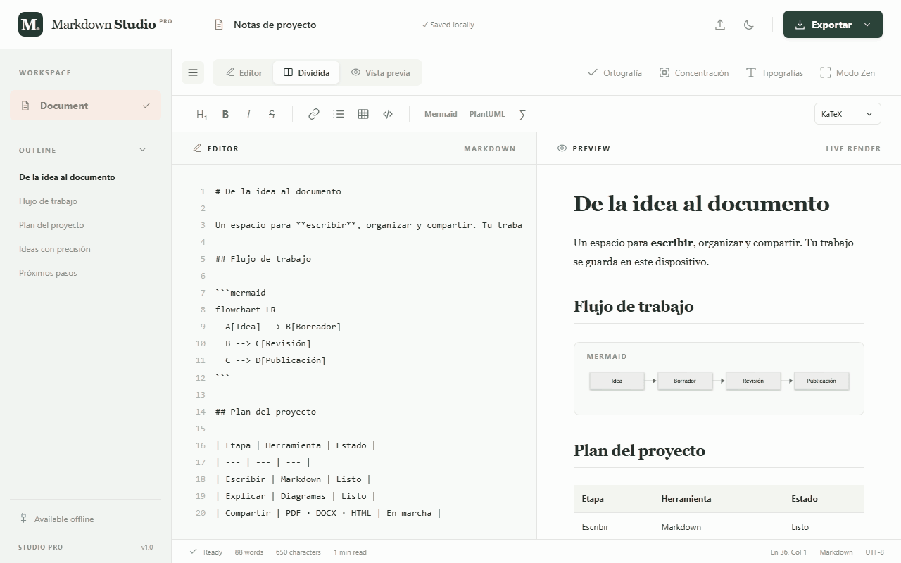
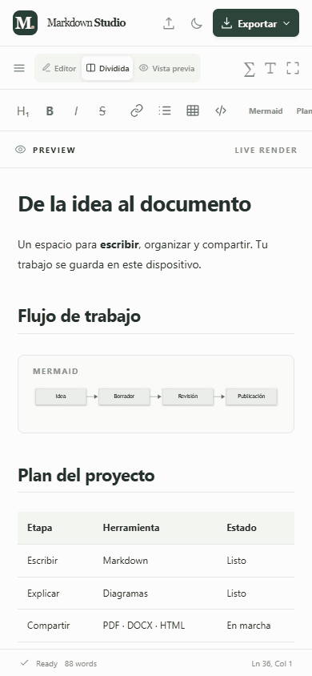

<div align="center">

# Markdown Studio Pro

**De la idea al documento. Un espacio para escribir, visualizar y compartir.**

[](https://github.com/AnalizaJech/markdown-studio-pro/actions/workflows/deploy.yml)


Editor Markdown con vista previa, diagramas y ecuaciones.<br>
Una interfaz adaptable, temas claro y oscuro, y documentos guardados en tu dispositivo.

**[Abrir la aplicación ↗](https://AnalizaJech.github.io/markdown-studio-pro/)** · [Ver el recorrido](#la-app-en-acción) · [Ejecutar localmente](#ejecutar-localmente)

</div>

---

## La app en acción

### Un escritorio para tus ideas

Recorrido real a **1280 × 800 px**: vista dividida, lectura, ecuaciones, tipografías, tema oscuro, exportación, concentración y modo Zen.



### Tu documento, también en el bolsillo

Recorrido real a **390 × 844 px**: panel lateral recuperable, índice, cambio de vistas, fuentes, tema oscuro, exportación y salida visible del modo Zen.

<div align="center">
  
</div>

> Los GIF muestran la interfaz funcionando con un documento de ejemplo. Las capturas están incluidas en el repositorio y no dependen de un alojamiento externo.

## Lo que puedes hacer

| | Herramienta | Qué aporta |
| :---: | --- | --- |
| ✍️ | **Editor · Vista previa · Dividida** | Escribe Markdown y revisa el resultado mientras trabajas. |
| 🧭 | **Índice del documento** | Navega por los encabezados y localízalos en el editor y la vista previa. |
| 📊 | **Mermaid y PlantUML** | Explica procesos con diagramas; PlantUML admite secuencias y flujos simples. |
| ∑ | **KaTeX y MathJax** | Escribe fórmulas en línea o en bloques y elige el motor de renderizado. |
| 🗂️ | **Tablas, listas y bloques de código** | Estructura notas, documentación y planes desde la barra de herramientas. |
| 🎨 | **Tipografías y tema oscuro** | Elige por separado la fuente de lectura y la del editor. |
| 🧘 | **Concentración y Zen** | Reduce distracciones; en Zen siempre tienes un botón para salir. |
| 📏 | **Estadísticas y ortografía** | Consulta palabras, caracteres, tiempo estimado de lectura y posición del cursor. |
| 📥 | **Importación y exportación** | Abre archivos Markdown y comparte en PDF, DOCX, HTML o Markdown. |
| 💾 | **Guardado local y modo offline** | Conserva el documento en este navegador y trabaja sin conexión tras la carga inicial. |

## Un flujo sencillo

1. **Escribe o importa** un archivo `.md`, `.markdown` o `.txt`.
2. **Da estructura** con encabezados, tablas, código, diagramas y ecuaciones.
3. **Revisa** en vista previa o dividida; usa el índice para ir a una sección.
4. **Elige tu espacio**: cambia fuentes, activa el tema oscuro o entra en Zen.
5. **Exporta** desde el menú según el destino del documento.

### El formato adecuado para cada ocasión

| Exportación | Ideal para | Alcance actual |
| --- | --- | --- |
| **Markdown** | Seguir editando o versionar el archivo | Descarga el texto original del editor. |
| **HTML** | Compartir una página independiente | Incluye diagramas y ecuaciones renderizados; conserva la tipografía de lectura. |
| **PDF** | Leer, imprimir o entregar | Abre el diálogo del navegador; selecciona **Guardar como PDF**. |
| **DOCX** | Continuar el trabajo en Word | Conserva títulos, párrafos, listas y contenido tabular básico; diagramas y fórmulas se exportan como texto. |

## Offline, con actualizaciones seguras

La versión de producción precarga los archivos de la aplicación mediante un **service worker**. Abre la app con conexión y deja completar la carga inicial para poder volver después sin red.

- **Tus documentos:** se guardan automáticamente en `localStorage` de este navegador. Exporta un `.md` para conservar una copia independiente o llevarlo a otro dispositivo.
- **Las nuevas versiones:** se comprueban al abrir la app y al volver a la pestaña.
- **El aviso:** cuando hay un build nuevo aparece **«Nueva versión disponible»**.
- **La actualización:** al pulsar **Actualizar**, la app guarda el documento y el estado antes de recargar. Si el guardado falla, evita la recarga y te avisa.
- **La caché:** cada build tiene una versión derivada de su contenido; se eliminan únicamente las cachés antiguas de esta aplicación.

## Atajos para escribir con fluidez

En macOS, usa **Cmd** donde se indica **Ctrl**.

| Acción | Atajo |
| --- | --- |
| Negrita | `Ctrl + B` |
| Cursiva | `Ctrl + I` |
| Enlace | `Ctrl + K` |
| Encabezado de nivel 1 | `Ctrl + Alt + 1` |
| Abrir Markdown | `Ctrl + O` |
| Guardar como Markdown | `Ctrl + S` |
| Alternar vista dividida y editor | `Ctrl + \` |
| Concentración | `Ctrl + Shift + J` |
| Salir de Zen o cerrar menús | `Esc` |

## Ejecutar localmente

Necesitas **Node.js 22.12 o posterior** y npm.

```bash
git clone https://github.com/AnalizaJech/markdown-studio-pro.git
cd markdown-studio-pro
npm ci
npm run dev
```

Abre la URL que indique Vite; normalmente:

**[localhost:5173/markdown-studio-pro/](http://localhost:5173/markdown-studio-pro/)**

### Probar la versión de producción

```bash
npm run build
npm run preview
```

Normalmente estará en **[localhost:4173/markdown-studio-pro/](http://localhost:4173/markdown-studio-pro/)**. El service worker se registra en esta versión; el servidor de desarrollo se utiliza para editar el proyecto.

## Publicación en GitHub Pages

El proyecto usa `base: '/markdown-studio-pro/'` para servir correctamente los recursos desde el subdirectorio del repositorio.

El [workflow de despliegue](.github/workflows/deploy.yml) se ejecuta al hacer push a `master` o al lanzarlo manualmente:

**Checkout → Node.js → npm ci → build → dist → GitHub Pages**

En el repositorio, configura **Settings → Pages → Source → GitHub Actions**.

## Tecnología y alcance

**Vite · TypeScript · markdown-it · Mermaid · KaTeX · MathJax · docx · Service Worker**

<details>
<summary><strong>Detalles de compatibilidad</strong></summary>

- **PlantUML:** intérprete local para secuencias y flujos simples. No incorpora el motor Java completo.
- **Ortografía:** utiliza el diccionario integrado del navegador y los idiomas que tengas instalados.
- **Guardado:** pertenece a este navegador y perfil; no se sincroniza automáticamente entre dispositivos.
- **Offline:** requiere la instalación inicial completa del paquete de producción.
- **Exportación visual:** usa PDF o HTML para conservar diagramas y fórmulas como se ven en la vista previa.

</details>

---

<div align="center">

**Escribe con claridad. Explica visualmente. Comparte a tu manera.**

[Abrir Markdown Studio Pro](https://AnalizaJech.github.io/markdown-studio-pro/)

</div>
